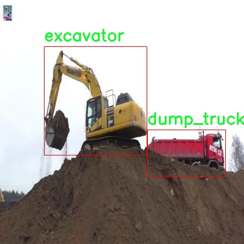

# 改进yolo11-GhostHGNetV2等200+全套创新点大全：工地施工车辆设备检测系统源码＆数据集全套

### 1.图片效果展示


##### 项目来源 **[人工智能促进会 2024.10.28](https://kdocs.cn/l/cszuIiCKVNis)**

注意：由于项目一直在更新迭代，上面“1.图片效果展示”和“2.视频效果展示”展示的系统图片或者视频可能为老版本，新版本在老版本的基础上升级如下：（实际效果以升级的新版本为准）

  （1）适配了YOLOV11的“目标检测”模型和“实例分割”模型，通过加载相应的权重（.pt）文件即可自适应加载模型。

  （2）支持“图片识别”、“视频识别”、“摄像头实时识别”三种识别模式。

  （3）支持“图片识别”、“视频识别”、“摄像头实时识别”三种识别结果保存导出，解决手动导出（容易卡顿出现爆内存）存在的问题，识别完自动保存结果并导出到tempDir中。

  （4）支持Web前端系统中的标题、背景图等自定义修改。

  另外本项目提供训练的数据集和训练教程,暂不提供权重文件（best.pt）,需要您按照教程进行训练后实现图片演示和Web前端界面演示的效果。

### 2.视频效果展示

[2.1 视频效果展示](https://www.bilibili.com/video/BV18Q1VYyEJz/)

### 3.背景

研究背景与意义

随着城市化进程的加快，建筑工地的施工活动日益频繁，施工车辆和设备的管理与监控成为保障施工安全和效率的重要环节。传统的人工监控方式不仅效率低下，而且容易受到人为因素的影响，难以实现实时、准确的设备检测。因此，基于计算机视觉的自动化检测系统应运而生，成为提升施工现场管理水平的有效手段。

在众多的目标检测算法中，YOLO（You Only Look Once）系列因其高效的实时检测能力而备受关注。YOLOv11作为该系列的最新版本，进一步提升了检测精度和速度，适用于复杂的施工环境。然而，针对特定场景如工地施工车辆设备的检测，YOLOv11仍存在一定的局限性，尤其是在小目标检测和多类目标混合场景下的表现。因此，改进YOLOv11以适应工地施工车辆设备的检测需求显得尤为重要。

本研究基于一个包含3000张图像的设备检测数据集，涵盖了混凝土搅拌车、翻斗车、挖掘机等多种施工车辆，旨在通过改进YOLOv11模型，提升其在工地环境中的检测能力。通过对数据集的深入分析与处理，结合先进的深度学习技术，研究将探索如何优化模型结构、增强特征提取能力，以实现对不同类型施工车辆的高效识别与定位。

本项目的实施不仅有助于提升施工现场的安全管理水平，还能为智能建筑工地的建设提供技术支持，推动建筑行业的数字化转型。通过构建高效的车辆设备检测系统，能够实现对施工车辆的实时监控与管理，从而降低事故发生率，提高施工效率，具有重要的现实意义和应用价值。

### 4.数据集信息展示

##### 4.1 本项目数据集详细数据（类别数＆类别名）

nc: 4
names: ['concrete_mixer_truck', 'dump', 'dump_truck', 'excavator']


该项目为【目标检测】数据集，请在【训练教程和Web端加载模型教程（第三步）】这一步的时候按照【目标检测】部分的教程来训练

##### 4.2 本项目数据集信息介绍

本项目数据集信息介绍

本项目所使用的数据集名为“equipment”，旨在为改进YOLOv11的工地施工车辆设备检测系统提供高质量的训练数据。该数据集包含四个主要类别，分别是混凝土搅拌车（concrete_mixer_truck）、自卸车（dump）、自卸卡车（dump_truck）和挖掘机（excavator）。这些类别涵盖了工地上常见的重型施工设备，具有重要的实际应用价值。

在数据集的构建过程中，团队收集了大量来自不同工地环境的图像，以确保数据的多样性和代表性。这些图像不仅包括各种角度和距离下的车辆，还涵盖了不同天气条件和光照环境下的场景。这种多样性有助于提高模型的鲁棒性，使其能够在真实世界中更好地识别和检测各种施工设备。

数据集中的每个类别都经过精确标注，确保训练过程中模型能够准确学习到每种设备的特征。标注工作由经验丰富的专业人员完成，采用了严格的质量控制流程，以保证数据的准确性和一致性。此外，数据集还考虑到了不同设备在工地上的实际应用场景，例如混凝土搅拌车在浇筑过程中、自卸车在运输材料时的状态，以及挖掘机在进行土方作业时的表现。这些细致的标注和多样化的场景设置为模型的训练提供了丰富的上下文信息。

通过使用“equipment”数据集，改进后的YOLOv11模型将能够更有效地识别和定位工地上的施工车辆设备，从而提升施工现场的安全性和工作效率。随着深度学习技术的不断发展，该数据集将为未来的研究和应用提供坚实的基础，推动工地智能化管理的进程。




### 5.全套项目环境部署视频教程（零基础手把手教学）

[5.1 所需软件PyCharm和Anaconda安装教程（第一步）](https://www.bilibili.com/video/BV1BoC1YCEKi/?spm_id_from=333.999.0.0&vd_source=bc9aec86d164b67a7004b996143742dc)


[5.2 安装Python虚拟环境创建和依赖库安装视频教程（第二步）](https://www.bilibili.com/video/BV1ZoC1YCEBw?spm_id_from=333.788.videopod.sections&vd_source=bc9aec86d164b67a7004b996143742dc)

### 6.改进YOLOv11训练教程和Web_UI前端加载模型教程（零基础手把手教学）

[6.1 改进YOLOv11训练教程和Web_UI前端加载模型教程（第三步）](https://www.bilibili.com/video/BV1BoC1YCEhR?spm_id_from=333.788.videopod.sections&vd_source=bc9aec86d164b67a7004b996143742dc)


按照上面的训练视频教程链接加载项目提供的数据集，运行train.py即可开始训练



     Epoch   gpu_mem       box       obj       cls    labels  img_size
     1/200     20.8G   0.01576   0.01955  0.007536        22      1280: 100%|██████████| 849/849 [14:42<00:00,  1.04s/it]
               Class     Images     Labels          P          R     mAP@.5 mAP@.5:.95: 100%|██████████| 213/213 [01:14<00:00,  2.87it/s]
                 all       3395      17314      0.994      0.957      0.0957      0.0843

     Epoch   gpu_mem       box       obj       cls    labels  img_size
     2/200     20.8G   0.01578   0.01923  0.007006        22      1280: 100%|██████████| 849/849 [14:44<00:00,  1.04s/it]
               Class     Images     Labels          P          R     mAP@.5 mAP@.5:.95: 100%|██████████| 213/213 [01:12<00:00,  2.95it/s]
                 all       3395      17314      0.996      0.956      0.0957      0.0845

     Epoch   gpu_mem       box       obj       cls    labels  img_size
     3/200     20.8G   0.01561    0.0191  0.006895        27      1280: 100%|██████████| 849/849 [10:56<00:00,  1.29it/s]
               Class     Images     Labels          P          R     mAP@.5 mAP@.5:.95: 100%|███████   | 187/213 [00:52<00:00,  4.04it/s]
                 all       3395      17314      0.996      0.957      0.0957      0.0845


###### [项目数据集下载链接](https://kdocs.cn/l/cszuIiCKVNis)

### 7.原始YOLOv11算法讲解


YOLO11 是 Ultralytics YOLO 系列的最新版本，结合了尖端的准确性、速度和效率，用于目标检测、分割、分类、定向边界框和姿态估计。与
YOLOv8 相比，它具有更少的参数和更好的结果，不难预见，YOLO11 在边缘设备上更高效、更快，将频繁出现在计算机视觉领域的最先进技术（SOTA）中。


**主要特点**

  * **增强的特征提取：**YOLO11 使用改进的主干和颈部架构来增强特征提取，以实现更精确的目标检测和复杂任务的性能。

  * **针对效率和速度优化：**精细的架构设计和优化的训练流程在保持准确性和性能之间最佳平衡的同时，提供更快的处理速度。

  * **更少的参数，更高的准确度：**YOLO11m 在 COCO 数据集上实现了比 YOLOv8m 更高的 mAP，参数减少了 22%，提高了计算效率，同时不牺牲准确度。

  * **跨环境的适应性：**YOLO11 可以无缝部署在边缘设备、云平台和配备 NVIDIA GPU 的系统上，确保最大的灵活性。

  * **支持广泛的任务范围：**YOLO11 支持各种计算机视觉任务，如目标检测、实例分割、图像分类、姿态估计和定向目标检测（OBB）。


### 8.200+种全套改进YOLOV11创新点原理讲解

#### 8.1 200+种全套改进YOLOV11创新点原理讲解大全

由于篇幅限制，每个创新点的具体原理讲解就不全部展开，具体见下列网址中的改进模块对应项目的技术原理博客网址【Blog】（创新点均为模块化搭建，原理适配YOLOv5~YOLOv11等各种版本）

[改进模块技术原理博客【Blog】网址链接](https://gitee.com/qunmasj/good)


#### 8.2 精选部分改进YOLOV11创新点原理讲解

###### 这里节选部分改进创新点展开原理讲解(完整的改进原理见上图和[改进模块技术原理博客链接](https://gitee.com/qunmasj/good)【如果此小节的图加载失败可以通过CSDN或者Github搜索该博客的标题访问原始博客，原始博客图片显示正常】


### YOLO-MS简介
实时目标检测，以YOLO系列为例，已在工业领域中找到重要应用，特别是在边缘设备（如无人机和机器人）中。与之前的目标检测器不同，实时目标检测器旨在在速度和准确性之间追求最佳平衡。为了实现这一目标，提出了大量的工作：从第一代DarkNet到CSPNet，再到最近的扩展ELAN，随着性能的快速增长，实时目标检测器的架构经历了巨大的变化。

尽管性能令人印象深刻，但在不同尺度上识别对象仍然是实时目标检测器面临的基本挑战。这促使作者设计了一个强大的编码器架构，用于学习具有表现力的多尺度特征表示。具体而言，作者从两个新的角度考虑为实时目标检测编码多尺度特征：

从局部视角出发，作者设计了一个具有简单而有效的分层特征融合策略的MS-Block。受到Res2Net的启发，作者在MS-Block中引入了多个分支来进行特征提取，但不同的是，作者使用了一个带有深度卷积的 Inverted Bottleneck Block块，以实现对大Kernel的高效利用。

从全局视角出发，作者提出随着网络加深逐渐增加卷积的Kernel-Size。作者在浅层使用小Kernel卷积来更高效地处理高分辨率特征。另一方面，在深层中，作者采用大Kernel卷积来捕捉广泛的信息。

基于以上设计原则，作者呈现了作者的实时目标检测器，称为YOLO-MS。为了评估作者的YOLO-MS的性能，作者在MS COCO数据集上进行了全面的实验。还提供了与其他最先进方法的定量比较，以展示作者方法的强大性能。如图1所示，YOLO-MS在计算性能平衡方面优于其他近期的实时目标检测器。


具体而言，YOLO-MS-XS在MS COCO上获得了43%+的AP得分，仅具有450万个可学习参数和8.7亿个FLOPs。YOLO-MS-S和YOLO-MS分别获得了46%+和51%+的AP，可学习参数分别为810万和2220万。此外，作者的工作还可以作为其他YOLO模型的即插即用模块。通常情况下，作者的方法可以将YOLOv11的AP从37%+显著提高到40%+，甚至还可以使用更少的参数和FLOPs。


#### Multi-Scale Building Block Design
CSP Block是一个基于阶段级梯度路径的网络，平衡了梯度组合和计算成本。它是广泛应用于YOLO系列的基本构建块。已经提出了几种变体，包括YOLOv4和YOLOv11中的原始版本，Scaled YOLOv4中的CSPVoVNet，YOLOv11中的ELAN，以及RTMDet中提出的大Kernel单元。作者在图2(a)和图2(b)中分别展示了原始CSP块和ELAN的结构。


上述实时检测器中被忽视的一个关键方面是如何在基本构建块中编码多尺度特征。其中一个强大的设计原则是Res2Net，它聚合了来自不同层次的特征以增强多尺度表示。然而，这一原则并没有充分探索大Kernel卷积的作用，而大Kernel卷积已经在基于CNN的视觉识别任务模型中证明有效。将大Kernel卷积纳入Res2Net的主要障碍在于它们引入的计算开销，因为构建块采用了标准卷积。在作者的方法中，作者提出用 Inverted Bottleneck Block替代标准的3 × 3卷积，以享受大Kernel卷积的好处。

基于前面的分析，作者提出了一个带有分层特征融合策略的全新Block，称为MS-Block，以增强实时目标检测器在提取多尺度特征时的能力，同时保持快速的推理速度。

MS-Block的具体结构如图2(c)所示。假设是输入特征。通过1×1卷积的转换后，X的通道维度增加到n*C。然后，作者将X分割成n个不同的组，表示为，其中。为了降低计算成本，作者选择n为3。

注意，除了之外，每个其他组都经过一个 Inverted Bottleneck Block层，用表示，其中k表示Kernel-Size，以获得。的数学表示如下：


根据这个公式，该博客的作者不将 Inverted Bottleneck Block层连接，使其作为跨阶段连接，并保留来自前面层的信息。最后，作者将所有分割连接在一起，并应用1×1卷积来在所有分割之间进行交互，每个分割都编码不同尺度的特征。当网络加深时，这个1×1卷积也用于调整通道数。

#### Heterogeneous Kernel Selection Protocol
除了构建块的设计外，作者还从宏观角度探讨了卷积的使用。之前的实时目标检测器在不同的编码器阶段采用了同质卷积（即具有相同Kernel-Size的卷积），但作者认为这不是提取多尺度语义信息的最佳选项。

在金字塔结构中，从检测器的浅阶段提取的高分辨率特征通常用于捕捉细粒度语义，将用于检测小目标。相反，来自网络较深阶段的低分辨率特征用于捕捉高级语义，将用于检测大目标。如果作者在所有阶段都采用统一的小Kernel卷积，深阶段的有效感受野（ERF）将受到限制，影响大目标的性能。在每个阶段中引入大Kernel卷积可以帮助解决这个问题。然而，具有大的ERF的大Kernel可以编码更广泛的区域，这增加了在小目标外部包含噪声信息的概率，并且降低了推理速度。

在这项工作中，作者建议在不同阶段中采用异构卷积，以帮助捕获更丰富的多尺度特征。具体来说，在编码器的第一个阶段中，作者采用最小Kernel卷积，而最大Kernel卷积位于最后一个阶段。随后，作者逐步增加中间阶段的Kernel-Size，使其与特征分辨率的增加保持一致。这种策略允许提取细粒度和粗粒度的语义信息，增强了编码器的多尺度特征表示能力。

正如图所示，作者将k的值分别分配给编码器中的浅阶段到深阶段，取值为3、5、7和9。作者将其称为异构Kernel选择（HKS）协议。


作者的HKS协议能够在深层中扩大感受野，而不会对浅层产生任何其他影响。此外，HKS不仅有助于编码更丰富的多尺度特征，还确保了高效的推理。

如表1所示，将大Kernel卷积应用于高分辨率特征会产生较高的计算开销。然而，作者的HKS协议在低分辨率特征上采用大Kernel卷积，从而与仅使用大Kernel卷积相比，大大降低了计算成本。


在实践中，作者经验性地发现，采用HKS协议的YOLO-MS的推理速度几乎与仅使用深度可分离的3 × 3卷积相同。

#### Architecture
如图所示，作者模型的Backbone由4个阶段组成，每个阶段后面跟随1个步长为2的3 × 3卷积进行下采样。在第3个阶段后，作者添加了1个SPP块，与RTMDet中一样。在作者的编码器上，作者使用PAFPN作为Neck来构建特征金字塔[31, 35]。它融合了从Backbone不同阶段提取的多尺度特征。Neck中使用的基本构建块也是作者的MS-Block，在其中使用3 × 3深度可分离卷积进行快速推理。

此外，为了在速度和准确性之间取得更好的平衡，作者将Backbone中多级特征的通道深度减半。作者提供了3个不同尺度的YOLO-MS变体，即YOLO-MS-XS、YOLO-MS-S和YOLO-MS。不同尺度的YOLO-MS的详细配置列在表2中。对于YOLO-MS的其他部分，作者将其保持与RTMDet相同。


### 9.系统功能展示

图9.1.系统支持检测结果表格显示

  图9.2.系统支持置信度和IOU阈值手动调节

  图9.3.系统支持自定义加载权重文件best.pt(需要你通过步骤5中训练获得)

  图9.4.系统支持摄像头实时识别

  图9.5.系统支持图片识别

  图9.6.系统支持视频识别

  图9.7.系统支持识别结果文件自动保存

  图9.8.系统支持Excel导出检测结果数据


### 10. YOLOv11核心改进源码讲解

#### 10.1 UniRepLKNet.py

以下是经过简化和注释的核心代码部分，保留了主要的功能和结构：

```python
import torch
import torch.nn as nn
import torch.nn.functional as F
from timm.layers import to_2tuple

class GRNwithNHWC(nn.Module):
    """ 
    GRN (Global Response Normalization) 层
    用于归一化输入特征图，增强模型的表达能力。
    输入格式为 (N, H, W, C)。
    """
    def __init__(self, dim, use_bias=True):
        super().__init__()
        self.use_bias = use_bias
        self.gamma = nn.Parameter(torch.zeros(1, 1, 1, dim))  # 学习参数 gamma
        if self.use_bias:
            self.beta = nn.Parameter(torch.zeros(1, 1, 1, dim))  # 学习参数 beta

    def forward(self, x):
        Gx = torch.norm(x, p=2, dim=(1, 2), keepdim=True)  # 计算输入的 L2 范数
        Nx = Gx / (Gx.mean(dim=-1, keepdim=True) + 1e-6)  # 归一化
        if self.use_bias:
            return (self.gamma * Nx + 1) * x + self.beta  # 应用归一化和偏置
        else:
            return (self.gamma * Nx + 1) * x  # 仅应用归一化

class SEBlock(nn.Module):
    """
    Squeeze-and-Excitation Block，增强特征通道的表达能力。
    输入格式为 (N, C, H, W)。
    """
    def __init__(self, input_channels, internal_neurons):
        super(SEBlock, self).__init__()
        self.down = nn.Conv2d(input_channels, internal_neurons, kernel_size=1)  # 降维
        self.up = nn.Conv2d(internal_neurons, input_channels, kernel_size=1)  # 升维
        self.nonlinear = nn.ReLU(inplace=True)  # 激活函数

    def forward(self, inputs):
        x = F.adaptive_avg_pool2d(inputs, output_size=(1, 1))  # 全局平均池化
        x = self.down(x)  # 降维
        x = self.nonlinear(x)  # 激活
        x = self.up(x)  # 升维
        x = torch.sigmoid(x)  # Sigmoid 激活
        return inputs * x.view(-1, inputs.size(1), 1, 1)  # 重新加权输入特征

class UniRepLKNetBlock(nn.Module):
    """
    UniRepLKNet 模块，包含卷积、归一化和激活等操作。
    """
    def __init__(self, dim, kernel_size, drop_path=0., deploy=False, use_sync_bn=False, ffn_factor=4):
        super().__init__()
        self.dwconv = nn.Conv2d(dim, dim, kernel_size=kernel_size, stride=1, padding=kernel_size // 2, groups=dim, bias=True)  # 深度卷积
        self.norm = nn.BatchNorm2d(dim) if not deploy else nn.Identity()  # 归一化层
        self.se = SEBlock(dim, dim // 4)  # Squeeze-and-Excitation 模块

        ffn_dim = int(ffn_factor * dim)  # 前馈网络维度
        self.pwconv1 = nn.Linear(dim, ffn_dim)  # 1x1 卷积（前馈网络第一层）
        self.act = nn.GELU()  # 激活函数
        self.pwconv2 = nn.Linear(ffn_dim, dim)  # 1x1 卷积（前馈网络第二层）

        self.drop_path = nn.Identity() if drop_path <= 0 else nn.Dropout(drop_path)  # DropPath

    def forward(self, x):
        x = self.dwconv(x)  # 深度卷积
        x = self.norm(x)  # 归一化
        x = self.se(x)  # Squeeze-and-Excitation
        x = self.pwconv1(x)  # 前馈网络第一层
        x = self.act(x)  # 激活
        x = self.pwconv2(x)  # 前馈网络第二层
        return self.drop_path(x)  # 应用 DropPath
```

### 代码分析与注释说明：
1. **GRNwithNHWC**：实现了全局响应归一化，增强了模型对特征的响应能力。通过学习参数 `gamma` 和 `beta` 来调整归一化后的输出。
  
2. **SEBlock**：实现了 Squeeze-and-Excitation 机制，通过全局平均池化和 1x1 卷积来动态调整通道的权重，增强了特征表达能力。

3. **UniRepLKNetBlock**：是 UniRepLKNet 的基本构建块，包含深度卷积、归一化、Squeeze-and-Excitation 以及前馈网络。使用了 DropPath 技术来提高模型的鲁棒性。

这些模块构成了 UniRepLKNet 的核心部分，能够处理多种输入数据类型，如音频、视频、点云等。

这个文件实现了一个名为UniRepLKNet的深度学习模型，主要用于音频、视频、点云、时间序列和图像识别等任务。它基于多个先进的模型架构，包括RepLKNet、ConvNeXt、DINO和DeiT等。代码中包含了多个模块和功能，下面是对主要部分的逐步分析。

首先，文件导入了必要的库，包括PyTorch及其相关模块。接着定义了一些基础的层，如GRN（全局响应归一化层）、NCHW到NHWC的转换层，以及NHWC到NCHW的转换层。这些层的作用是对输入数据进行格式转换和归一化处理，以适应后续的卷积操作。

接下来，文件中定义了一个函数`get_conv2d`，用于根据输入参数选择合适的卷积实现，支持原生卷积和iGEMM（高效的大核卷积实现）。此函数会根据卷积核的大小、步幅、填充等参数判断是否使用iGEMM实现。

`get_bn`函数用于选择批归一化层，可以选择同步批归一化或普通批归一化，适应不同的训练需求。

接着定义了Squeeze-and-Excitation Block（SEBlock），这是一个用于增强特征表达能力的模块，通过自适应地调整通道权重来提高模型性能。

`DilatedReparamBlock`类实现了一个膨胀重参数化块，支持多种卷积核大小和膨胀率的组合，旨在提高模型的感受野和特征提取能力。

`UniRepLKNetBlock`类是UniRepLKNet的基本构建块，包含了深度卷积、归一化、SEBlock和前馈网络等组件。它支持不同的配置，如是否使用检查点（checkpoint）以节省内存。

`UniRepLKNet`类是整个模型的核心，构造函数中定义了输入通道数、类别数、各层的深度和特征维度等参数。模型的前向传播过程分为多个阶段，每个阶段包含多个UniRepLKNetBlock。模型还支持在推理模式下进行优化，以提高推理速度。

此外，文件中还定义了一些辅助函数和方法，如`update_weight`用于更新模型权重，`switch_to_deploy`用于将模型切换到推理模式。

最后，文件中提供了一些模型构造函数（如`unireplknet_a`、`unireplknet_f`等），这些函数可以根据不同的配置和预训练权重构建相应的模型。

在文件的最后部分，提供了一个简单的测试代码，用于创建模型实例并进行前向传播，输出模型的特征表示。这段代码可以用于验证模型的正确性和性能。

总体来说，这个文件实现了一个灵活且高效的深度学习模型，适用于多种视觉和非视觉任务，具有良好的扩展性和可配置性。

#### 10.2 lsknet.py

以下是经过简化和注释的核心代码部分：

```python
import torch
import torch.nn as nn
from functools import partial

class Mlp(nn.Module):
    """ 多层感知机（MLP）模块 """
    def __init__(self, in_features, hidden_features=None, out_features=None, act_layer=nn.GELU, drop=0.):
        super().__init__()
        out_features = out_features or in_features  # 输出特征数
        hidden_features = hidden_features or in_features  # 隐藏层特征数
        self.fc1 = nn.Conv2d(in_features, hidden_features, 1)  # 第一个卷积层
        self.dwconv = DWConv(hidden_features)  # 深度卷积层
        self.act = act_layer()  # 激活函数
        self.fc2 = nn.Conv2d(hidden_features, out_features, 1)  # 第二个卷积层
        self.drop = nn.Dropout(drop)  # Dropout层

    def forward(self, x):
        """ 前向传播 """
        x = self.fc1(x)
        x = self.dwconv(x)
        x = self.act(x)
        x = self.drop(x)
        x = self.fc2(x)
        x = self.drop(x)
        return x


class Attention(nn.Module):
    """ 注意力模块 """
    def __init__(self, d_model):
        super().__init__()
        self.proj_1 = nn.Conv2d(d_model, d_model, 1)  # 投影层1
        self.activation = nn.GELU()  # 激活函数
        self.spatial_gating_unit = LSKblock(d_model)  # 空间门控单元
        self.proj_2 = nn.Conv2d(d_model, d_model, 1)  # 投影层2

    def forward(self, x):
        """ 前向传播 """
        shortcut = x.clone()  # 保留输入用于残差连接
        x = self.proj_1(x)
        x = self.activation(x)
        x = self.spatial_gating_unit(x)
        x = self.proj_2(x)
        x = x + shortcut  # 残差连接
        return x


class Block(nn.Module):
    """ 基本块，包括注意力和MLP """
    def __init__(self, dim, mlp_ratio=4., drop=0., drop_path=0., act_layer=nn.GELU):
        super().__init__()
        self.norm1 = nn.BatchNorm2d(dim)  # 第一层归一化
        self.norm2 = nn.BatchNorm2d(dim)  # 第二层归一化
        self.attn = Attention(dim)  # 注意力模块
        self.mlp = Mlp(in_features=dim, hidden_features=int(dim * mlp_ratio), act_layer=act_layer, drop=drop)  # MLP模块

    def forward(self, x):
        """ 前向传播 """
        x = x + self.attn(self.norm1(x))  # 添加注意力模块的输出
        x = x + self.mlp(self.norm2(x))  # 添加MLP模块的输出
        return x


class LSKNet(nn.Module):
    """ LSKNet模型 """
    def __init__(self, img_size=224, in_chans=3, embed_dims=[64, 128, 256, 512], depths=[3, 4, 6, 3]):
        super().__init__()
        self.num_stages = len(depths)  # 模型阶段数

        for i in range(self.num_stages):
            # 创建嵌入层和块
            patch_embed = OverlapPatchEmbed(img_size=img_size // (2 ** i), in_chans=in_chans if i == 0 else embed_dims[i - 1], embed_dim=embed_dims[i])
            block = nn.ModuleList([Block(dim=embed_dims[i]) for _ in range(depths[i])])
            setattr(self, f"patch_embed{i + 1}", patch_embed)
            setattr(self, f"block{i + 1}", block)

    def forward(self, x):
        """ 前向传播 """
        outs = []
        for i in range(self.num_stages):
            patch_embed = getattr(self, f"patch_embed{i + 1}")
            block = getattr(self, f"block{i + 1}")
            x, _, _ = patch_embed(x)  # 嵌入层
            for blk in block:
                x = blk(x)  # 通过每个块
            outs.append(x)  # 保存输出
        return outs


class DWConv(nn.Module):
    """ 深度卷积模块 """
    def __init__(self, dim=768):
        super(DWConv, self).__init__()
        self.dwconv = nn.Conv2d(dim, dim, 3, padding=1, groups=dim)  # 深度卷积

    def forward(self, x):
        """ 前向传播 """
        return self.dwconv(x)


def lsknet_t(weights=''):
    """ 创建LSKNet-t模型 """
    model = LSKNet(embed_dims=[32, 64, 160, 256], depths=[3, 3, 5, 2])
    if weights:
        model.load_state_dict(torch.load(weights)['state_dict'])  # 加载权重
    return model

if __name__ == '__main__':
    model = lsknet_t('lsk_t_backbone-2ef8a593.pth')  # 实例化模型
    inputs = torch.randn((1, 3, 640, 640))  # 随机输入
    for i in model(inputs):
        print(i.size())  # 输出每个阶段的输出尺寸
```

### 代码核心部分解释：
1. **Mlp类**：实现了一个多层感知机，包括两个卷积层和一个深度卷积层，使用GELU激活函数和Dropout。
2. **Attention类**：实现了一个注意力机制，包含两个投影层和一个空间门控单元（LSKblock）。
3. **Block类**：结合了注意力模块和MLP模块，使用BatchNorm进行归一化，并实现了残差连接。
4. **LSKNet类**：整体模型结构，包含多个阶段，每个阶段由嵌入层和多个Block组成。
5. **DWConv类**：实现了深度卷积，用于特征提取。
6. **lsknet_t函数**：用于创建LSKNet-t模型并加载预训练权重。

通过这些核心部分的组合，构建了一个深度学习模型，适用于图像处理任务。

这个程序文件 `lsknet.py` 实现了一个名为 LSKNet 的深度学习模型，主要用于图像处理任务。代码中使用了 PyTorch 框架，并定义了一系列的神经网络模块和函数。

首先，文件导入了必要的库，包括 PyTorch 的核心模块和一些实用工具。接着，定义了多个类，每个类代表了模型中的一个组成部分。

`Mlp` 类实现了一个多层感知机（MLP），包含两个卷积层和一个深度卷积层。它的前向传播方法将输入数据通过这些层进行处理，并使用 GELU 激活函数和 Dropout 进行正则化。

`LSKblock` 类是一个特殊的模块，包含多个卷积层和注意力机制。它通过空间卷积和深度卷积来提取特征，并使用 Sigmoid 函数进行加权，最终生成注意力图，从而对输入进行加权。

`Attention` 类实现了一个注意力机制，使用了 `LSKblock` 作为空间门控单元。它通过一系列卷积层对输入进行变换，并与输入的快捷连接相加，以增强特征表示。

`Block` 类则将注意力机制和 MLP 结合在一起，形成一个完整的块结构。它使用 Batch Normalization 进行归一化，并引入了 DropPath 技术来增强模型的鲁棒性。

`OverlapPatchEmbed` 类负责将输入图像转换为补丁嵌入，使用卷积层进行特征提取，并对嵌入进行归一化处理。

`LSKNet` 类是整个模型的核心，包含多个阶段的处理。每个阶段都有自己的补丁嵌入、块和归一化层。模型的前向传播方法会依次处理输入数据，并将每个阶段的输出存储起来。

`DWConv` 类实现了深度卷积操作，用于在 `Mlp` 类中进行特征处理。

此外，文件中还定义了两个函数 `update_weight` 和 `lsknet_t`、`lsknet_s`，用于加载预训练权重和创建不同配置的 LSKNet 模型。

最后，在 `__main__` 块中，示例代码展示了如何创建一个 LSKNet 模型实例，并对随机生成的输入数据进行前向传播，输出每个阶段的特征图的尺寸。

总体而言，这个文件实现了一个复杂的深度学习模型，结合了多种先进的技术，如注意力机制和深度卷积，适用于图像处理任务。

#### 10.3 VanillaNet.py

以下是经过简化并添加详细中文注释的核心代码部分：

```python
import torch
import torch.nn as nn
import torch.nn.functional as F
from timm.layers import weight_init

# 定义激活函数类
class Activation(nn.ReLU):
    def __init__(self, dim, act_num=3, deploy=False):
        super(Activation, self).__init__()
        self.deploy = deploy  # 是否为部署模式
        # 初始化权重和偏置
        self.weight = torch.nn.Parameter(torch.randn(dim, 1, act_num * 2 + 1, act_num * 2 + 1))
        self.bias = None
        self.bn = nn.BatchNorm2d(dim, eps=1e-6)  # 批归一化
        self.dim = dim
        self.act_num = act_num
        weight_init.trunc_normal_(self.weight, std=.02)  # 权重初始化

    def forward(self, x):
        # 前向传播
        if self.deploy:
            return F.conv2d(
                super(Activation, self).forward(x), 
                self.weight, self.bias, padding=(self.act_num * 2 + 1) // 2, groups=self.dim)
        else:
            return self.bn(F.conv2d(
                super(Activation, self).forward(x),
                self.weight, padding=self.act_num, groups=self.dim))

    def switch_to_deploy(self):
        # 切换到部署模式，融合批归一化
        if not self.deploy:
            kernel, bias = self._fuse_bn_tensor(self.weight, self.bn)
            self.weight.data = kernel
            self.bias = torch.nn.Parameter(torch.zeros(self.dim))
            self.bias.data = bias
            self.__delattr__('bn')  # 删除bn属性
            self.deploy = True

    def _fuse_bn_tensor(self, weight, bn):
        # 融合批归一化和卷积层的权重
        kernel = weight
        running_mean = bn.running_mean
        running_var = bn.running_var
        gamma = bn.weight
        beta = bn.bias
        eps = bn.eps
        std = (running_var + eps).sqrt()
        t = (gamma / std).reshape(-1, 1, 1, 1)
        return kernel * t, beta + (0 - running_mean) * gamma / std

# 定义基本块
class Block(nn.Module):
    def __init__(self, dim, dim_out, act_num=3, stride=2, deploy=False):
        super().__init__()
        self.deploy = deploy
        # 根据是否为部署模式选择不同的卷积层
        if self.deploy:
            self.conv = nn.Conv2d(dim, dim_out, kernel_size=1)
        else:
            self.conv1 = nn.Sequential(
                nn.Conv2d(dim, dim, kernel_size=1),
                nn.BatchNorm2d(dim, eps=1e-6),
            )
            self.conv2 = nn.Sequential(
                nn.Conv2d(dim, dim_out, kernel_size=1),
                nn.BatchNorm2d(dim_out, eps=1e-6)
            )
        # 池化层
        self.pool = nn.MaxPool2d(stride) if stride != 1 else nn.Identity()
        self.act = Activation(dim_out, act_num)  # 激活函数

    def forward(self, x):
        # 前向传播
        if self.deploy:
            x = self.conv(x)
        else:
            x = self.conv1(x)
            x = F.leaky_relu(x, negative_slope=1)  # 使用Leaky ReLU激活
            x = self.conv2(x)

        x = self.pool(x)  # 池化
        x = self.act(x)  # 激活
        return x

# 定义VanillaNet模型
class VanillaNet(nn.Module):
    def __init__(self, in_chans=3, num_classes=1000, dims=[96, 192, 384, 768], 
                 drop_rate=0, act_num=3, strides=[2, 2, 2, 1], deploy=False):
        super().__init__()
        self.deploy = deploy
        # 初始化输入层
        if self.deploy:
            self.stem = nn.Sequential(
                nn.Conv2d(in_chans, dims[0], kernel_size=4, stride=4),
                Activation(dims[0], act_num)
            )
        else:
            self.stem1 = nn.Sequential(
                nn.Conv2d(in_chans, dims[0], kernel_size=4, stride=4),
                nn.BatchNorm2d(dims[0], eps=1e-6),
            )
            self.stem2 = nn.Sequential(
                nn.Conv2d(dims[0], dims[0], kernel_size=1, stride=1),
                nn.BatchNorm2d(dims[0], eps=1e-6),
                Activation(dims[0], act_num)
            )

        self.stages = nn.ModuleList()
        for i in range(len(strides)):
            stage = Block(dim=dims[i], dim_out=dims[i + 1], act_num=act_num, stride=strides[i], deploy=deploy)
            self.stages.append(stage)  # 添加基本块

    def forward(self, x):
        # 前向传播
        if self.deploy:
            x = self.stem(x)
        else:
            x = self.stem1(x)
            x = F.leaky_relu(x, negative_slope=1)
            x = self.stem2(x)

        for stage in self.stages:
            x = stage(x)  # 通过每个基本块
        return x

# 示例代码，创建模型并进行前向传播
if __name__ == '__main__':
    inputs = torch.randn((1, 3, 640, 640))  # 随机输入
    model = VanillaNet()  # 创建模型
    pred = model(inputs)  # 前向传播
    print(pred.size())  # 输出预测结果的尺寸
```

### 代码说明：
1. **Activation 类**：自定义的激活函数类，继承自 `nn.ReLU`，并添加了批归一化和权重初始化功能。
2. **Block 类**：构建网络的基本块，包含卷积层、池化层和激活函数。根据是否为部署模式选择不同的卷积结构。
3. **VanillaNet 类**：主网络结构，包含输入层和多个基本块，支持不同的输入通道和输出通道设置。
4. **前向传播**：在 `forward` 方法中定义了数据如何通过网络进行处理。
5. **示例代码**：在主程序中创建模型并进行一次前向传播，输出结果的尺寸。

该程序文件 `VanillaNet.py` 实现了一个名为 VanillaNet 的深度学习模型，主要用于图像处理任务。文件开头包含版权信息和许可证声明，表示该程序遵循 MIT 许可证，可以自由使用和修改。

程序中导入了 PyTorch 库及其相关模块，主要用于构建神经网络。`timm.layers` 中的 `weight_init` 和 `DropPath` 用于权重初始化和可能的路径丢弃功能。`numpy` 库也被导入，主要用于处理数组。

在代码中，首先定义了一个 `activation` 类，继承自 `nn.ReLU`，用于实现自定义的激活函数。该类在初始化时创建了一个可学习的权重参数和一个批归一化层。`forward` 方法定义了前向传播的过程，支持在部署模式下和训练模式下的不同计算方式。`switch_to_deploy` 方法用于将模型切换到部署模式，融合批归一化的权重。

接下来定义了一个 `Block` 类，表示网络中的一个基本模块。该模块可以根据是否在部署模式下选择不同的卷积和激活方式。`forward` 方法实现了模块的前向传播，包含卷积、激活和池化操作。`switch_to_deploy` 方法同样用于将模块切换到部署模式。

`VanillaNet` 类是整个模型的核心，包含多个 `Block` 模块。初始化时，模型根据输入通道数、类别数、各层维度、丢弃率、激活函数数量、步幅等参数构建网络结构。模型的前向传播过程会经过多个阶段，最终输出特征图。

`update_weight` 函数用于更新模型的权重，确保新权重与模型结构相匹配。接下来定义了一系列函数（如 `vanillanet_5` 到 `vanillanet_13_x1_5_ada_pool`），用于创建不同配置的 VanillaNet 模型，并支持加载预训练权重。

最后，在 `__main__` 部分，创建了一个输入张量并实例化了 `vanillanet_10` 模型，随后进行前向传播并打印输出特征图的尺寸。这部分代码用于测试模型的基本功能。

整体来看，该文件实现了一个灵活且可扩展的卷积神经网络结构，适用于多种图像处理任务，且提供了多种模型配置和预训练权重加载的功能。

#### 10.4 metaformer.py

以下是代码中最核心的部分，并附上详细的中文注释：

```python
import torch
import torch.nn as nn
import torch.nn.functional as F

class MF_Attention(nn.Module):
    """
    实现了Transformer中的自注意力机制。
    参考文献：https://arxiv.org/abs/1706.03762
    """
    def __init__(self, dim, head_dim=32, num_heads=None, qkv_bias=False,
                 attn_drop=0., proj_drop=0., proj_bias=False):
        super().__init__()

        # 头的维度
        self.head_dim = head_dim
        # 缩放因子
        self.scale = head_dim ** -0.5

        # 计算头的数量
        self.num_heads = num_heads if num_heads else dim // head_dim
        if self.num_heads == 0:
            self.num_heads = 1
        
        # 计算注意力的维度
        self.attention_dim = self.num_heads * self.head_dim

        # 定义Q、K、V的线性变换
        self.qkv = nn.Linear(dim, self.attention_dim * 3, bias=qkv_bias)
        # 定义注意力的dropout
        self.attn_drop = nn.Dropout(attn_drop)
        # 定义输出的线性变换
        self.proj = nn.Linear(self.attention_dim, dim, bias=proj_bias)
        # 定义输出的dropout
        self.proj_drop = nn.Dropout(proj_drop)

    def forward(self, x):
        # 获取输入的批次大小、高度、宽度和通道数
        B, H, W, C = x.shape
        N = H * W  # 计算总的token数量

        # 计算Q、K、V
        qkv = self.qkv(x).reshape(B, N, 3, self.num_heads, self.head_dim).permute(2, 0, 3, 1, 4)
        q, k, v = qkv.unbind(0)  # 分离Q、K、V

        # 计算注意力权重
        attn = (q @ k.transpose(-2, -1)) * self.scale
        attn = attn.softmax(dim=-1)  # 归一化
        attn = self.attn_drop(attn)  # 应用dropout

        # 计算输出
        x = (attn @ v).transpose(1, 2).reshape(B, H, W, self.attention_dim)
        x = self.proj(x)  # 投影到原始维度
        x = self.proj_drop(x)  # 应用dropout
        return x  # 返回输出

class Mlp(nn.Module):
    """
    实现了MLP（多层感知机），用于MetaFormer模型。
    """
    def __init__(self, dim, mlp_ratio=4, out_features=None, act_layer=nn.ReLU, drop=0., bias=False):
        super().__init__()
        in_features = dim
        out_features = out_features or in_features
        hidden_features = int(mlp_ratio * in_features)

        # 定义第一层线性变换
        self.fc1 = nn.Linear(in_features, hidden_features, bias=bias)
        self.act = act_layer()  # 激活函数
        self.drop1 = nn.Dropout(drop)  # dropout层
        # 定义第二层线性变换
        self.fc2 = nn.Linear(hidden_features, out_features, bias=bias)
        self.drop2 = nn.Dropout(drop)  # dropout层

    def forward(self, x):
        x = self.fc1(x)  # 第一层线性变换
        x = self.act(x)  # 激活
        x = self.drop1(x)  # 应用dropout
        x = self.fc2(x)  # 第二层线性变换
        x = self.drop2(x)  # 应用dropout
        return x  # 返回输出

class MetaFormerBlock(nn.Module):
    """
    实现一个MetaFormer块。
    """
    def __init__(self, dim,
                 token_mixer=nn.Identity, mlp=Mlp,
                 norm_layer=nn.LayerNorm,
                 drop=0., drop_path=0.,
                 layer_scale_init_value=None, res_scale_init_value=None):
        super().__init__()

        # 归一化层
        self.norm1 = norm_layer(dim)
        self.token_mixer = token_mixer(dim=dim, drop=drop)  # token混合器
        self.drop_path1 = nn.Dropout(drop_path) if drop_path > 0. else nn.Identity()  # drop path
        self.layer_scale1 = nn.Parameter(torch.ones(dim)) if layer_scale_init_value else nn.Identity()  # 层缩放
        self.res_scale1 = nn.Parameter(torch.ones(dim)) if res_scale_init_value else nn.Identity()  # 残差缩放

        self.norm2 = norm_layer(dim)
        self.mlp = mlp(dim=dim, drop=drop)  # MLP
        self.drop_path2 = nn.Dropout(drop_path) if drop_path > 0. else nn.Identity()  # drop path
        self.layer_scale2 = nn.Parameter(torch.ones(dim)) if layer_scale_init_value else nn.Identity()  # 层缩放
        self.res_scale2 = nn.Parameter(torch.ones(dim)) if res_scale_init_value else nn.Identity()  # 残差缩放

    def forward(self, x):
        # 进行前向传播
        x = self.norm1(x)  # 归一化
        x = self.token_mixer(x)  # token混合
        x = self.drop_path1(x)  # 应用drop path
        x = self.layer_scale1(x) + x  # 残差连接

        x = self.norm2(x)  # 归一化
        x = self.mlp(x)  # MLP
        x = self.drop_path2(x)  # 应用drop path
        x = self.layer_scale2(x) + x  # 残差连接
        return x  # 返回输出
```

### 代码核心部分说明：
1. **MF_Attention**: 实现了自注意力机制，主要用于计算输入的Q、K、V，并通过softmax归一化得到注意力权重，最后计算输出。
2. **Mlp**: 实现了一个简单的多层感知机，包含两个线性层和激活函数，支持dropout。
3. **MetaFormerBlock**: 实现了MetaFormer的基本块，包含归一化、token混合、MLP等模块，支持残差连接和drop path。

这些模块是构建MetaFormer模型的基础，提供了自注意力、MLP和残差连接等关键功能。

这个程序文件 `metaformer.py` 实现了一些用于构建 MetaFormer 模型的基本组件，主要包括各种层和模块。文件中使用了 PyTorch 框架，并且引入了一些自定义的激活函数、注意力机制、卷积层以及归一化层等。

首先，文件定义了几个自定义的层。`Scale` 类用于通过元素乘法对输入进行缩放，支持可训练的参数。`SquaredReLU` 和 `StarReLU` 是两种不同的激活函数，分别实现了平方的 ReLU 和带有缩放和偏置的 ReLU。`MF_Attention` 类实现了基本的自注意力机制，按照 Transformer 的结构，计算查询、键、值并进行注意力加权。

接下来，`RandomMixing` 类实现了一种随机混合机制，利用一个随机矩阵对输入进行变换。`LayerNormGeneral` 类是一个通用的层归一化实现，支持不同的输入形状和归一化维度。`LayerNormWithoutBias` 是一种更快的归一化实现，直接使用优化过的 `F.layer_norm`。

`SepConv` 类实现了反向可分离卷积，采用了两个线性层和一个深度卷积层的组合。`Pooling` 类实现了一种特定的池化操作，返回输入与池化结果的差值。`Mlp` 类实现了一个多层感知机，通常用于 MetaFormer 模型中。

`ConvolutionalGLU` 类实现了一种卷积门控线性单元（GLU），结合了卷积和激活函数。最后，`MetaFormerBlock` 和 `MetaFormerCGLUBlock` 类实现了 MetaFormer 的基本模块，分别使用不同的 token 混合器和 MLP 结构。它们都包含了归一化、残差连接和可选的 dropout 操作。

整体来看，这个文件提供了构建 MetaFormer 模型所需的基础组件，灵活性高，适用于不同的输入形状和网络结构，能够支持多种深度学习任务。

注意：由于此博客编辑较早，上面“10.YOLOv11核心改进源码讲解”中部分代码可能会优化升级，仅供参考学习，以“11.完整训练+Web前端界面+200+种全套创新点源码、数据集获取”的内容为准。

### 11.完整训练+Web前端界面+200+种全套创新点源码、数据集获取


# [下载链接：https://mbd.pub/o/bread/Zp6XlZZt](https://mbd.pub/o/bread/Zp6XlZZt)